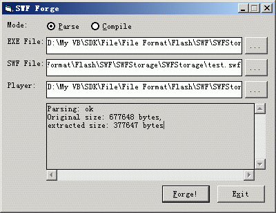



## SWF Forge

### Description

SWF Forage, a parser/extractor and a compiler of swf file. I found similar codes on psc but I wish to do it in a more clear and faster way.

Extracting compiled flash(.exe) back to swf file. It is easy to do compile a swf file to a standalone exe without a separate palyer, but it depends on what version Flash you made the swf, because new features with new Flash. If new features used in swf, older player maybe play it correctly. So a workaround solution is to use the latest player:) And I included a small play game as resource and automatically extracted it to "Marshi Maro.exe" since psc will automatically remove any file with PE headers, no matter what you name the file.

And I make these two functions into a class for handy usage. I used Copymemory for a better performance. Please feel free to leave any comments, bugs or suggestions are welcome!

Next version will feature in automatically list IE cached swf files for users to select. Maybe I will develop a much more robust version in really parsing the frames of a swf file to gifs.

Some basic function classes are found on psc, but the core swf storage class is written by me.

I strictly follow the coding standard so that I hope you can learn abou it without too much difficult. Sorry for lack of detail code comments, but I think that the method is really simple.
 
### More Info
 

             |
---                |---
**Submitted On**   |2005-03-17 23:29:20
**By**             |[enmity](https://github.com/Planet-Source-Code/PSCIndex/blob/master/ByAuthor/enmity.md)
**Level**          |Intermediate
**User Rating**    |5.0 (20 globes from 4 users)
**Compatibility**  |VB 4\.0 \(32\-bit\), VB 5\.0, VB 6\.0, ASP \(Active Server Pages\) 
**Category**       |[Files/ File Controls/ Input/ Output](https://github.com/Planet-Source-Code/PSCIndex/blob/master/ByCategory/files-file-controls-input-output__1-3.md)
**World**          |[Visual Basic](https://github.com/Planet-Source-Code/PSCIndex/blob/master/ByWorld/visual-basic.md)
**Archive File**   |[SWF\_Forge1865763182005\.zip](https://github.com/Planet-Source-Code/enmity-swf-forge__1-59527/archive/master.zip)

### API Declarations

CopyMemory For a better performance

